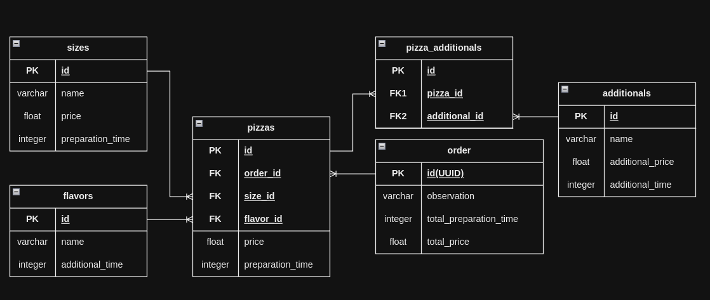

<h1 align="center">API Pizzeria</h1>

### 🛠 Technologies

The following tools were used in building the project:
- [NestJs](https://nestjs.com/)
- [Node.js](https://nodejs.org/en/)
- [Typescript](https://www.typescriptlang.org/)
- [Docker](https://www.docker.com/)
- [Docker Compose](https://docs.docker.com/compose/)
- [Maria DB](https://mariadb.org/)
- [phpMyAdmin](https://www.phpmyadmin.net/)
- [Swagger](https://swagger.io/)

## Project Description
<p>
This project is a developed for a technical challenge a pizzeria system where customers can build and customize pizzas by selecting size, flavor, and optional extras. It calculates the total price and preparation time, providing a detailed order summary.</p>

The project is deployed in Vercel, and is using DigitalOcean MySQL cluster.
<br />
https://pizza-api-eta.vercel.app/
<br />
<br />
The "/" route is where the documentation that was created using Swagger is located.

## General Information
<h3 align="center">Database Design</h3>
<h1 align="center">
  
</h1>

### 🎲 Running

```bash
# up docker containers:
$ tusk up
$ make up
$ docker compose up -d

# duplicate .env.example to .env and configure like this:
NODE_ENV=development
BASE_URL=http://localhost:3001
DATABASE_TYPE=mysql
DATABASE_HOST=pizza-api-database
DATABASE_PORT=3306
DATABASE_USER=root
DATABASE_PASSWORD=secret
DATABASE_NAME=pizza_api
DATABASE_SCHEMA=public
DATABASE_SYNCHRONIZE=false

# enter in node container:
$ tusk node bash
$ make node bash
$ docker compose exec node bash

# install the dependencies
$ npm run install

# run the migrations and register the initial data
$ npm run migration:run

# run the seeders
$ npm run seed

# Run the application in development mode
$ npm run dev

# The api server will start on the port configured (default 3001) - access <http://localhost:3001>
```